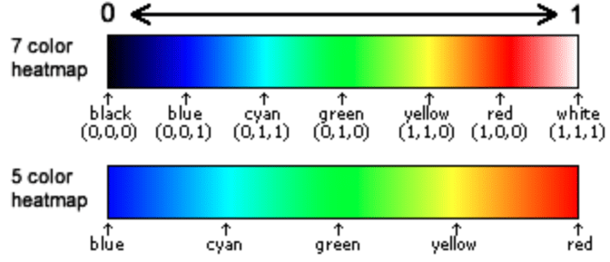
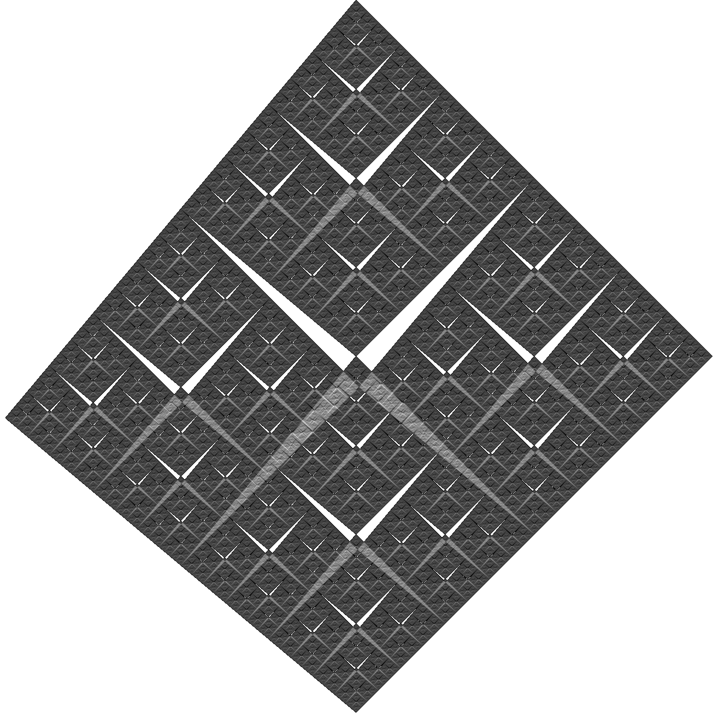

This is an extract from old resume like project that has not been online for years. It's now live on [GitHub Pages](https://chrisacrobat.github.io/FractalImagesGeneration/?corners=3&cornerPlacement=0), go there to see it in action.

_Hint: There is a secret menu in the lower right corner where different heatmap modes can be selected._
|  |
|:---:|
| _[Image source: andrewnoske.com](https://www.andrewnoske.com/wiki/File:Heatmap_gradient.png")_ |

_Another hint: Corners can manually be specified by writing them as angles or relative coordinates from the center._
| [?corners=0,90,180,260](https://chrisacrobat.github.io/FractalImagesGeneration/?corners=0,90,180,260) | [?corners=0,0;1,1;-1,-1;1,-1;-1,1](https://chrisacrobat.github.io/FractalImagesGeneration/?corners=0,0;1,1;-1,-1;1,-1;-1,1) |
|---|---|
|  | ![Generated fractal with relative coordinates [0,0], [1,1], [-1,-1], [1,-1], [-1,1].](coordinates_[0,0],[1,1],[-1,-1],[1,-1],[-1,1].png) |

Inspiration from [Chaos Game - Numberphile](https://youtu.be/kbKtFN71Lfs).
